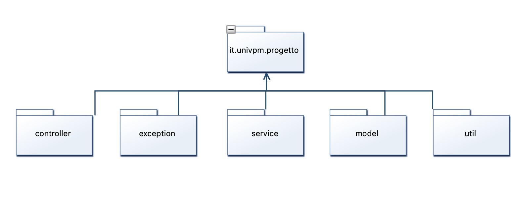
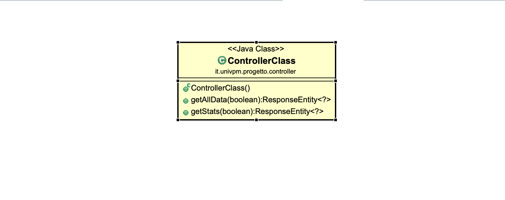
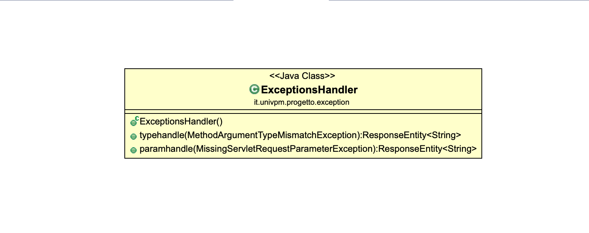
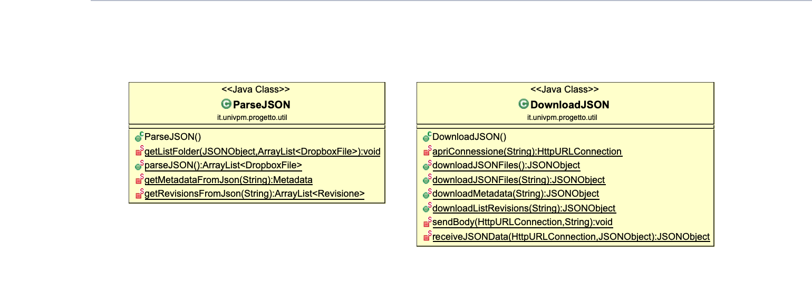
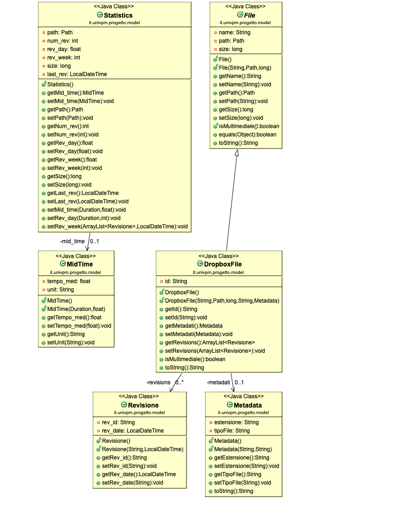
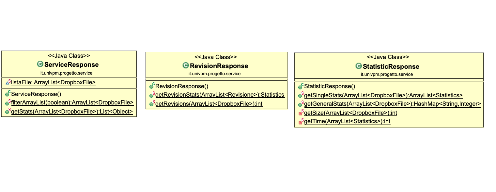
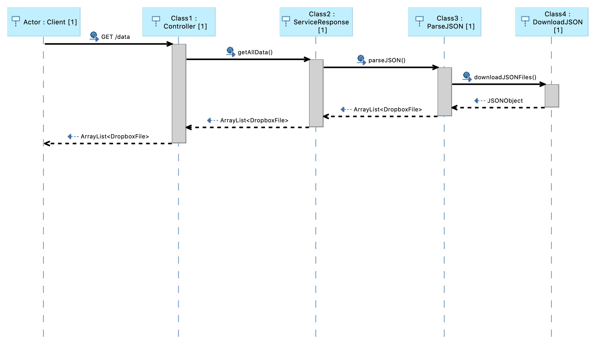
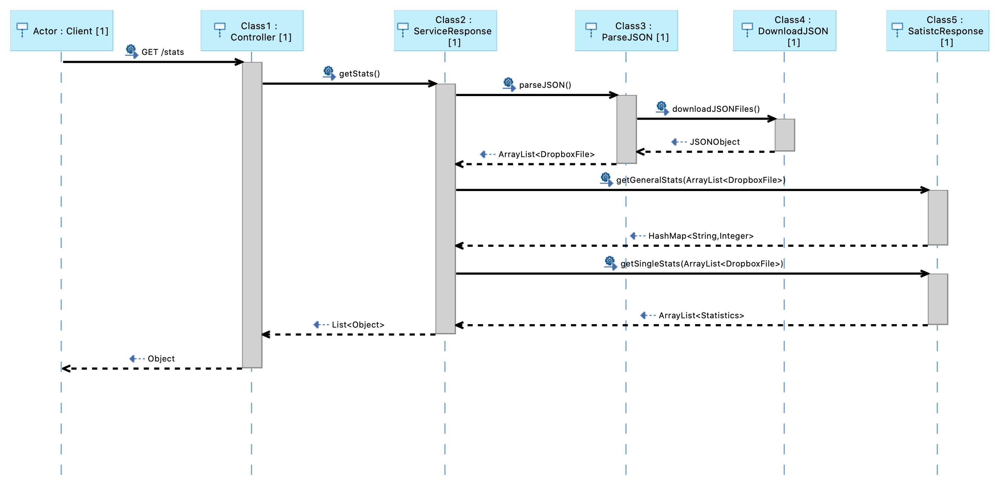

# progetto OOP

Il progetto, che ha come tema il servizio di cloud storage DropBox, permette di ottenere informazioni e statistiche
sui files contenuti in una cartella del DropBox attraverso REST API di tipo GET ( -GET: "/data"  e  -GET: "/stats" )

Per fare ciò ci si avvale di un client (Postman) che invia richieste al server Tomcat, lanciato dal main del programma che può essere eseguito come SpringBoot App grazie all'apposito framework, sulla porta 8080.

### Diagramma dei casi d'uso:


L'utente può inoltre scegliere di mostrare le informazioni e le statistiche divise per file multimediali e non, inserendo un parametro nella rotta della richiesta (seguono esempi) :


### -GET: "/data"   :

```
{
        "name": "G0050359.JPG",
        "path": "file:///C:/applicazioni/appesameoop/g0050359.jpg",
        "size": 3562590,
        "id": "id:Da93-6CogPsAAAAAAAAAHg",
        "metadati": {
            "estensione": ".jpg",
            "tipoFile": "photo"
        },
        "revisions": [
            {
                "rev_id": "015adca1f81322600000001e95fc080",
                "rev_date": "2020-08-26T16:15:06"
            }
        ],
        "multimediale": true
    }
```

### -GET: "/stats"    :

In questo caso si è pensato di inserire anche delle statistiche generali sui file presenti nella cartella DropBox :
```
{
        ".pdf": 2,
        ".mp4": 1,
        ".odt": 4,
        ".docx": 1,
        "File's Average Size (bytes)": 3088556,
        "Revision's Average Time (hours)": 9,
        "Files Revisions": 23
    }
```
Per le statistiche sui singoli file si è scelto di utilizzare una differente struttura, mantenendo la relazione con la rotta "data" tramite il pathfile :
```
{
            "path": "file:///C:/applicazioni/appesameoop/prova/splendiani_devid_1087057.pdf",
            "num_rev": 1,
            "mid_time": null,
            "rev_day": 0.0,
            "rev_week": 0.0,
            "size": 2155716,
            "last_rev": "2020-08-26T16:23:12"
        }
```

Per effettuare la visualizzazione dei file multimediali o meno, l'utente deve specificare un parametro di tipo booleano nella rotta; negli esempi qui sopra sono state utilizzate le seguenti :

```
http://localhost:8080/data?multi=true

http://localhost:8080/stats?multi=false
```

## Diagrammi UML

### Packages



### Diagrammi delle classi

**Class : ProgettoApplication (main)**


**Class : Controller**



**Class : Exception**



**Class : Util**



**Class : Model**



**Class : Service**




### Diagrammi delle sequenze


-GET: "/data"





-GET: "/stats"





## Autore

**Splendiani Devid** : https://github.com/Devid86

